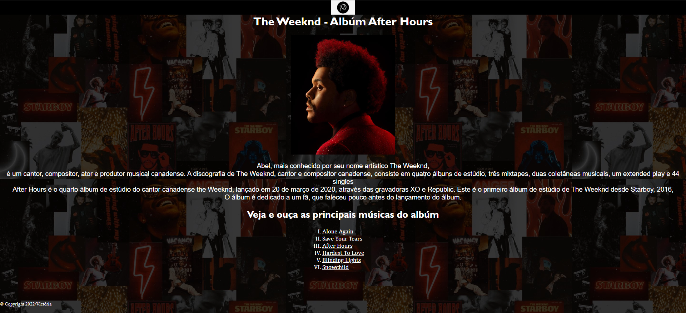

# Site do cantor The Weeknd

[Clique aqui para acessar o site](https://github.com/vickr-g/projeto-site-the-weeknd).
---
## sobre

Site para fins ditaticos do Professor Leonid em LIMA.
O objetivo desse projeto é colocar em prática os conhecimentos, sobre desenvolvimentos de sites, adquiridos no curso do [SENAI Jandira](https://jandira.sp.senai.br/).

---
## tecnologias utlizadas
- HTML 5
- CSS3
- Responsividade
- Markdown

---
## Autor
-[Victoria Gindre](https://github.com/vickr-g)